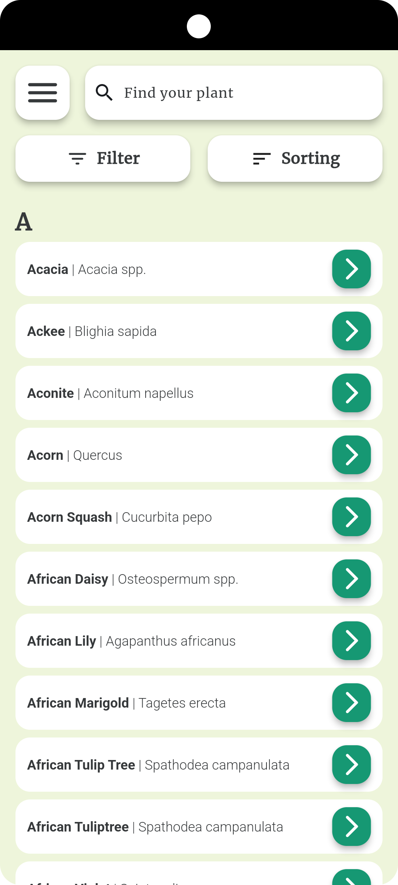
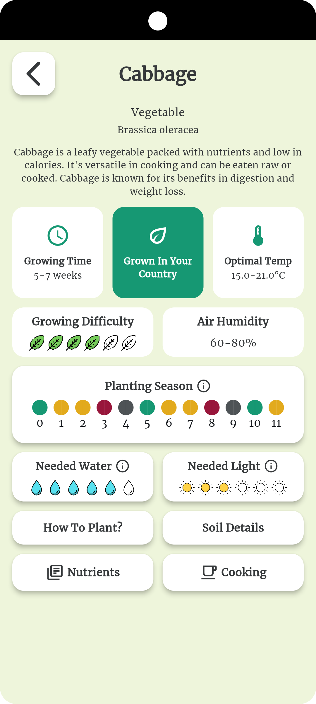
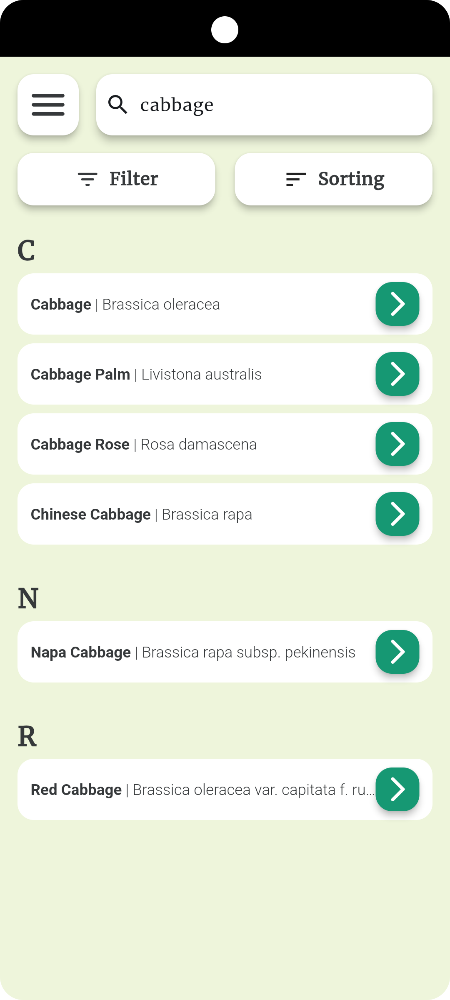

# 🌱 **GardenGenius**

**GardenGenius** is a mobile app built with **Flutter** for iOS and Android, designed to help beginner and professional gardeners alike create sustainable environments in their gardens. The app contains information on nearly 1000 different plants and uses AI to suggest plant pairings based on user selections.

---

## 🚀 **Features**

### 📚 **Plant Encyclopedia**

GardenGenius offers detailed information on nearly 1000 plants, including:

- **Name** & **Latin Name**
- **Countries** where the plant can grow
- **Optimal Air Humidity** & **Temperature**
- **Growing Time** and **Growing Difficulty**
- Detailed **Planting Instructions** and a **Seasonal Planting Calendar**
- Required **Light, Water, and Soil** conditions
- Year-round maintenance tips

### 🔍 **AI Plant Matching**

- Select plants and let the AI **suggest complementary plants**.
- **Check compatibility** between selected plants to ensure they will grow harmoniously together.

### 🔄 **Seasonal Planting Calendar**

Get a personalized **seasonal calendar** for each plant with detailed guidance on when and how to plant, maintain, and harvest your garden.

---

## 🧠 **Powered by AI**

The plant database was created with **ChatGPT** and stored in **Firestore**. Our AI analyzes your plant selection and suggests complementary plants, checking factors like:

- **Soil compatibility**
- **Water needs**
- **Sunlight exposure**

---

## 🛠️ **Tech Stack**

- **Flutter** for cross-platform app development (iOS/Android)
- **Firestore** for real-time database management
- **Dart** as the programming language
- **AI Engine** for intelligent plant suggestions

---

## 📦 **Getting Started**

### **Prerequisites**

- [Flutter SDK](https://flutter.dev/docs/get-started/install)
- Dart SDK (included with Flutter)
- [Firebase account](https://firebase.google.com) for Firestore

---

## 📸 **Screenshots**

---

## 💡 **Future Improvements**

- Add a **community forum** for gardeners to share tips and advice.
- Implement **plant disease detection** using image recognition.
- Expand the plant database with more **region-specific plants**.
- Integrate with **smart gardening systems** to automate watering and plant monitoring.

---

## 📄 **License**

This project is licensed under the **MIT License** - see the [LICENSE](LICENSE) file for details.

## **Contact**

For any issues or contributions, feel free to open a pull request or create an issue in the repository.

Happy coding!

samples, guidance on mobile development, and a full API reference.

Privacy Policy

**Privacy Policy**

This privacy policy applies to the Gardener app (hereby referred to as "Application") for mobile devices that was created by Grzanston (hereby referred to as "Service Provider") as an Open Source service. This service is intended for use "AS IS".

**Information Collection and Use**

The Application collects information when you download and use it. This information may include information such as

*   Your device's Internet Protocol address (e.g. IP address)
*   The pages of the Application that you visit, the time and date of your visit, the time spent on those pages
*   The time spent on the Application
*   The operating system you use on your mobile device

The Application does not gather precise information about the location of your mobile device.

The Application collects your device's location, which helps the Service Provider determine your approximate geographical location and make use of in below ways:

*   Geolocation Services: The Service Provider utilizes location data to provide features such as personalized content, relevant recommendations, and location-based services.
*   Analytics and Improvements: Aggregated and anonymized location data helps the Service Provider to analyze user behavior, identify trends, and improve the overall performance and functionality of the Application.
*   Third-Party Services: Periodically, the Service Provider may transmit anonymized location data to external services. These services assist them in enhancing the Application and optimizing their offerings.

The Service Provider may use the information you provided to contact you from time to time to provide you with important information, required notices and marketing promotions.

For a better experience, while using the Application, the Service Provider may require you to provide us with certain personally identifiable information. The information that the Service Provider request will be retained by them and used as described in this privacy policy.

**Third Party Access**

Only aggregated, anonymized data is periodically transmitted to external services to aid the Service Provider in improving the Application and their service. The Service Provider may share your information with third parties in the ways that are described in this privacy statement.

Please note that the Application utilizes third-party services that have their own Privacy Policy about handling data. Below are the links to the Privacy Policy of the third-party service providers used by the Application:

*   [Google Play Services](https://www.google.com/policies/privacy/)
*   [Google Analytics for Firebase](https://firebase.google.com/support/privacy)
*   [Firebase Crashlytics](https://firebase.google.com/support/privacy/)

The Service Provider may disclose User Provided and Automatically Collected Information:

*   as required by law, such as to comply with a subpoena, or similar legal process;
*   when they believe in good faith that disclosure is necessary to protect their rights, protect your safety or the safety of others, investigate fraud, or respond to a government request;
*   with their trusted services providers who work on their behalf, do not have an independent use of the information we disclose to them, and have agreed to adhere to the rules set forth in this privacy statement.

**Opt-Out Rights**

You can stop all collection of information by the Application easily by uninstalling it. You may use the standard uninstall processes as may be available as part of your mobile device or via the mobile application marketplace or network.

**Data Retention Policy**

The Service Provider will retain User Provided data for as long as you use the Application and for a reasonable time thereafter. If you'd like them to delete User Provided Data that you have provided via the Application, please contact them at grzan.dev@gmail.com and they will respond in a reasonable time.

**Children**

The Service Provider does not use the Application to knowingly solicit data from or market to children under the age of 13.

The Application does not address anyone under the age of 13. The Service Provider does not knowingly collect personally identifiable information from children under 13 years of age. In the case the Service Provider discover that a child under 13 has provided personal information, the Service Provider will immediately delete this from their servers. If you are a parent or guardian and you are aware that your child has provided us with personal information, please contact the Service Provider (grzan.dev@gmail.com) so that they will be able to take the necessary actions.

**Security**

The Service Provider is concerned about safeguarding the confidentiality of your information. The Service Provider provides physical, electronic, and procedural safeguards to protect information the Service Provider processes and maintains.

**Changes**

This Privacy Policy may be updated from time to time for any reason. The Service Provider will notify you of any changes to the Privacy Policy by updating this page with the new Privacy Policy. You are advised to consult this Privacy Policy regularly for any changes, as continued use is deemed approval of all changes.

This privacy policy is effective as of 2024-09-07

**Your Consent**

By using the Application, you are consenting to the processing of your information as set forth in this Privacy Policy now and as amended by us.

**Contact Us**

If you have any questions regarding privacy while using the Application, or have questions about the practices, please contact the Service Provider via email at grzan.dev@gmail.com.

* * *

This privacy policy page was generated by [App Privacy Policy Generator](https://app-privacy-policy-generator.nisrulz.com/)

Gardener provides you with comprahensive guide on companion planting and planting overall. With the app you can get information about various plants planting instructions along with fun-facts, nutrition data and cooking proposals.
